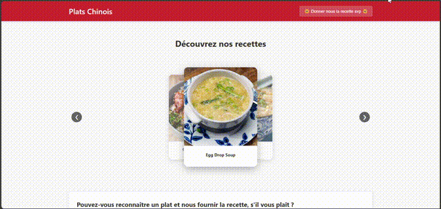

# Mini-Plateforme de Recettes Chinoises

## Présentation du projet

Cette application est une mini-plateforme permettant de découvrir des recettes chinoises. Le concept principal est de présenter aux utilisateurs une collection de plats chinois. Si un utilisateur reconnaît un plat et connaît sa recette, il peut la partager en utilisant un formulaire intégré.

L'application est construite sur une architecture conteneurisée complète avec Docker Compose, comprenant:
- Un frontend React pour l'interface utilisateur
- Un backend Node.js/Express pour l'API
- Une base de données MongoDB pour le stockage des données
- Un serveur Nginx comme reverse proxy

## Fonctionnalités

- **Affichage des plats chinois**: L'application récupère automatiquement des photos de plats chinois depuis l'API TheMealDB.
- **Partage de recettes**: Les utilisateurs qui reconnaissent un plat peuvent soumettre leur propre recette (nom, ingrédients, instructions, temps de préparation et de cuisson).
- **Visualisation des recettes**: Interface utilisateur intuitive permettant de parcourir les différentes recettes.
## Démonstration

### Version vidéo

## Structure technique

### Architecture

```
mini-plateforme/
├── backend/                # API Node.js/Express
│   ├── Dockerfile
│   ├── package.json
│   ├── server.js
│   └── routes/
│       └── recipes.js      # Gestion des routes pour l'API de recettes
├── frontend/               # Application React
│   ├── Dockerfile
│   ├── package.json
│   ├── public/
│   └── src/
│       ├── App.js
│       ├── App.css
│       └── components/
│           ├── RecipeCard.js
│           ├── RecipeForm.js
│           └── RecipeList.js
├── nginx/                  # Configuration du serveur web
│   └── nginx.conf
├── .env                    # Variables d'environnement
└── docker-compose.yml      # Configuration Docker Compose
```

### Technologies utilisées

- **Frontend**: React.js
- **Backend**: Node.js/Express
- **Base de données**: MongoDB
- **API externe**: TheMealDB pour récupérer des informations sur les plats chinois
- **Conteneurisation**: Docker et Docker Compose
- **Serveur web**: Nginx (reverse proxy)

## Explication des services

### 1. Frontend (React)
Service qui gère l'interface utilisateur. Il est responsable de l'affichage des recettes, du formulaire d'ajout, et de l'interaction avec l'utilisateur. Le frontend communique avec le backend via des requêtes HTTP pour récupérer et envoyer des données.

### 2. Backend (Node.js/Express)
Service qui expose une API REST pour gérer les recettes. Il traite les requêtes du frontend, communique avec la base de données pour stocker et récupérer les informations, et interagit également avec l'API externe TheMealDB pour importer des recettes chinoises.

### 3. Base de données (MongoDB)
Service qui stocke toutes les données de l'application. MongoDB a été choisi pour sa flexibilité de schéma, ce qui est idéal pour stocker des données de différentes sources (recettes manuelles et recettes importées).

### 4. Reverse Proxy (Nginx)
Service qui sert de point d'entrée unique pour toute l'application. Il redirige les requêtes API vers le backend et sert les fichiers statiques du frontend. Cela permet d'avoir une seule URL pour accéder à l'ensemble de l'application.

## Liens vers les images Docker Hub

- Frontend: [node:18-alpine](https://hub.docker.com/_/node) (build) et [nginx:alpine](https://hub.docker.com/_/nginx) (runtime)
- Backend: [node:18-alpine](https://hub.docker.com/_/node)
- Base de données: [mongo:6](https://hub.docker.com/_/mongo)
- Reverse Proxy: [nginx:alpine](https://hub.docker.com/_/nginx)

## Prérequis

- Docker et Docker Compose installés sur votre machine
- Accès à Internet pour récupérer les images Docker et les données de TheMealDB

## Installation et démarrage

1. **Clonez le dépôt**
   ```bash
   git clone [URL_DU_REPO]
   cd mini-plateforme
   ```

2. **Configurez les variables d'environnement**
   
   Créez un fichier `.env` à la racine du projet avec le contenu suivant:
   ```
   # Configuration des ports
   NGINX_PORT=80
   BACKEND_PORT=5000

   # Configuration MongoDB
   MONGO_URI=mongodb://db:27017/recipes
   MONGO_INITDB_DATABASE=recipes

   # Configuration frontend
   REACT_APP_API_URL=http://localhost/api/recipes
   ```

3. **Lancez l'application avec Docker Compose**
   ```bash
   docker-compose up -d
   ```

4. **Accédez à l'application**
   
   Ouvrez votre navigateur et accédez à `http://localhost`

## Commandes Docker Compose utiles

- **Démarrer les conteneurs en arrière-plan**
  ```bash
  docker-compose up -d
  ```

- **Voir les logs de tous les services**
  ```bash
  docker-compose logs
  ```

- **Voir les logs d'un service spécifique**
  ```bash
  docker-compose logs backend
  ```

- **Arrêter tous les conteneurs**
  ```bash
  docker-compose down
  ```

- **Reconstruire les images et redémarrer les services**
  ```bash
  docker-compose up -d --build
  ```

## Détails techniques et défis rencontrés

### Importation des recettes

Le backend récupère automatiquement une liste de plats chinois depuis l'API TheMealDB. Cette récupération se fait lors du premier démarrage ou lorsqu'un utilisateur clique sur le bouton d'importation.

```javascript
// Extrait du code backend - Récupération depuis TheMealDB
const response = await axios.get('https://www.themealdb.com/api/json/v1/1/filter.php?a=Chinese');
if (response.data && response.data.meals) {
  const mealDbRecipes = response.data.meals;
  // Sauvegarder les recettes dans la base de données
  // ...
}
```

### Schéma de la base de données

Le schéma MongoDB a été conçu pour gérer deux types de données:
1. Les recettes importées depuis TheMealDB (avec strMeal, strMealThumb, idMeal)
2. Les recettes ajoutées manuellement par les utilisateurs (avec name, ingredients, instructions, etc.)

```javascript
const recipeSchema = new mongoose.Schema({
  // Champs pour les recettes manuelles
  name: { type: String, required: false },
  ingredients: [String],
  instructions: String,
  prepTime: Number,
  cookTime: Number,
  
  // Champs pour les recettes de TheMealDB
  idMeal: String,
  strMeal: String,
  strMealThumb: String,
  
  createdAt: { type: Date, default: Date.now }
});
```

### Défis rencontrés et solutions

1. **Erreur 403 Forbidden avec Nginx**
   
   Problème: Nginx ne trouvait pas les fichiers statiques du frontend.
   
   Solution: Création manuelle du build React et configuration du volume dans docker-compose.yml.

2. **Problème de connexion au backend**
   
   Problème: Le frontend tentait d'accéder directement au port 5000 au lieu de passer par le proxy Nginx.
   
   Solution: Configuration de l'URL de l'API dans le frontend pour utiliser `http://localhost/api/recipes` au lieu de `http://localhost:5000/api/recipes`.

3. **Erreur "services.volumes must be a mapping"**
   
   Problème: Syntaxe incorrecte dans le fichier docker-compose.yml.
   
   Solution: Correction de l'indentation et du format des volumes dans le fichier YAML.

4. **Intégration de l'API TheMealDB**
   
   Défi: Adapter le schéma de données pour supporter à la fois les recettes TheMealDB et les recettes utilisateur.
   
   Solution: Création d'un schéma flexible et d'un composant d'affichage adaptatif qui reconnaît le format des données.

## Questions de réflexion

### 1. Quelle est la différence entre `build:` et `image:` dans Docker Compose ?

- **build:** indique à Docker Compose de construire une image personnalisée à partir d'un Dockerfile spécifié. Vous définissez généralement un chemin vers le répertoire contenant le Dockerfile et d'éventuelles options de construction.

  Exemple:
  ```yaml
  services:
    frontend:
      build:
        context: ./frontend
        dockerfile: Dockerfile
  ```

- **image:** indique à Docker Compose d'utiliser une image existante, soit depuis Docker Hub, soit depuis un registre privé. Aucune construction n'est nécessaire.

  Exemple:
  ```yaml
  services:
    db:
      image: mongo:6
  ```

La différence principale est donc que `build` crée une nouvelle image à partir de votre code source, tandis que `image` utilise une image déjà prête. Dans notre projet, nous utilisons `build` pour les services frontend et backend (qui nécessitent notre code personnalisé) et `image` pour la base de données et Nginx (qui sont des services standard).

### 2. Quel est l'intérêt d'utiliser un fichier `.env` dans un projet Docker ?

L'utilisation d'un fichier `.env` présente plusieurs avantages:

1. **Séparation de la configuration et du code**: Les variables d'environnement sont stockées séparément des fichiers de configuration Docker, ce qui facilite la maintenance.

2. **Sécurité**: Les informations sensibles (mots de passe, clés API, etc.) ne sont pas stockées en clair dans les fichiers de configuration versionés.

3. **Environnements multiples**: Permet de définir différentes configurations pour différents environnements (développement, test, production) en changeant simplement le fichier `.env`.

4. **Centralisation**: Toutes les variables d'environnement sont définies à un seul endroit, ce qui simplifie la gestion et évite les duplications.

Dans notre projet, le fichier `.env` contient les configurations de ports, les URL de connexion à la base de données, et d'autres paramètres qui pourraient varier selon l'environnement de déploiement.

### 3. Comment les volumes Docker aident-ils à gérer la persistance des données ?

Les volumes Docker résolvent le problème fondamental de la persistance des données dans les conteneurs, qui sont par nature éphémères. Voici comment ils aident:

1. **Persistance des données**: Les données stockées dans un volume persistent même si le conteneur est supprimé ou recréé.

2. **Partage de données**: Les volumes peuvent être partagés entre plusieurs conteneurs, permettant l'échange de données.

3. **Performance**: Les volumes sont généralement plus performants que les bind mounts car ils sont gérés par Docker.

4. **Isolation**: Les volumes sont isolés du système de fichiers hôte, ce qui améliore la sécurité et la portabilité.

Dans notre projet, nous utilisons un volume nommé `mongodb_data` pour stocker les données de MongoDB:
```yaml
volumes:
  mongodb_data:
    name: mini-platform-mongodb-data
```

Cela garantit que les recettes et autres données persistant même si le conteneur MongoDB est redémarré ou recréé.

### 4. Si vous deviez ajouter un quatrième service (ex : un reverse proxy NGINX), comment l'intégreriez-vous ?

Note: Notre projet contient déjà un service Nginx comme reverse proxy (c'est notre quatrième service). Voici comment il a été intégré:

1. **Ajout du service dans docker-compose.yml**:
   ```yaml
   nginx:
     image: nginx:alpine
     container_name: mini-platform-nginx
     restart: unless-stopped
     ports:
       - "${NGINX_PORT}:80"
     volumes:
       - ./nginx/nginx.conf:/etc/nginx/nginx.conf
       - ./frontend/build:/usr/share/nginx/html
     depends_on:
       - frontend
       - backend
     networks:
       - app-network
   ```

2. **Création du fichier de configuration nginx.conf**:
   ```nginx
   worker_processes 1;

   events {
       worker_connections 1024;
   }

   http {
       include       /etc/nginx/mime.types;
       default_type  application/octet-stream;
       
       server {
           listen 80;
           server_name localhost;
           
           # Frontend - Fichiers statiques React build
           location / {
               root   /usr/share/nginx/html;
               index  index.html index.htm;
               try_files $uri $uri/ /index.html;
           }
           
           # Backend API - Proxy pour le service backend
           location /api/ {
               proxy_pass http://backend:5000/api/;
               proxy_http_version 1.1;
               proxy_set_header Upgrade $http_upgrade;
               proxy_set_header Connection 'upgrade';
               proxy_set_header Host $host;
               proxy_cache_bypass $http_upgrade;
           }
       }
   }
   ```

3. **Modification des dépendances**: Nous avons configuré Nginx pour démarrer après le frontend et le backend.

4. **Configuration des volumes**: Nous avons monté les fichiers de configuration et les fichiers statiques du frontend.

5. **Exposition des ports**: Seul Nginx expose un port au monde extérieur (80), les autres services communiquent via le réseau interne Docker.

Si nous devions ajouter un cinquième service (par exemple un service de cache Redis), nous suivrions une approche similaire:
1. Ajouter le service dans docker-compose.yml
2. Configurer les volumes nécessaires
3. Définir les dépendances entre les services
4. Connecter le service au réseau interne
5. Modifier les services existants pour communiquer avec le nouveau service

## Extensions possibles

- Ajout d'une authentification utilisateur
- Intégration de la recherche de recettes par ingrédients
- Système de notation et commentaires sur les recettes
- Support pour d'autres types de cuisines
- Implémentation de tests unitaires et d'intégration

## Conclusion

Cette mini-plateforme démontre la mise en œuvre d'une architecture multi-conteneurs avec Docker Compose, où chaque service joue un rôle spécifique. L'application utilise une API externe (TheMealDB) pour récupérer des données réelles et offre aux utilisateurs la possibilité de contribuer avec leurs propres connaissances.

La modularité de cette architecture permet d'ajouter facilement de nouvelles fonctionnalités ou de mettre à l'échelle les services existants selon les besoins.